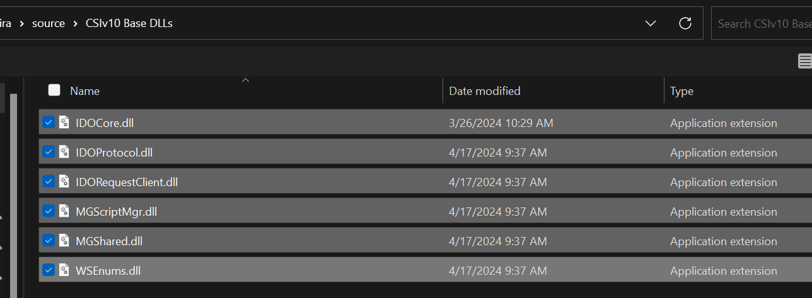

# SyteLine Extension Class Testing Framework

This is the repository for the Extension Class Testing framework that I presented at SUN 2024 in Tampa, FL.

---

## Setup

In the Program.cs file you will need to update the slserver url. 
- string slserver = "https://YourSyteLineServer/IDORequestService/RequestService.aspx";
    - Where it says "YourSytelineServer" you need to update with your server name. if you are on prem, this is the first part of the url before /wswebclient/. If you are in the cloud, you can get this by openingg the edit mode, then it is the first part of the url before /wswebclient/.

You will also need to update this line - OpenSessionResponseData res = oclient.OpenSession("username@domain.com", "ThisIsAPassword", "ConfigurationName");

- username should be the username you use to log into SyteLine
- password will be the password, but if you sign in with workstation login, or some other method, you might need to reset this use password before using it. 
- ConfigurationName is the name of the configuration you are using. This is the name of the configuration in the SyteLine client. If you are unsure you can get this from the sites form. 

---

## Get the Mongoose Dll Files
If needed, to get the .dll files you can edit any form in Syteline, then in the top right section, in properties, you will see the pencil icon. Hit the drop down next to it and download the file. This will download a .zip file of the solution for this form. Extract this .zip and you will find the needed dll files in the mg-bin file.

You will need to save these somewhere on your computer to reference in projects. I created a folder to store them just ourside of my repos location. 

In Visual studio you will need to add a reference to these dll files. Right click on the project in the solution explorer and select Add Reference. Then browse to the location of the dll files and select the ones you need.

Select Browse, and the Browse button on the bottom right

Navigate to the location of the dll files and select the ones you need.

